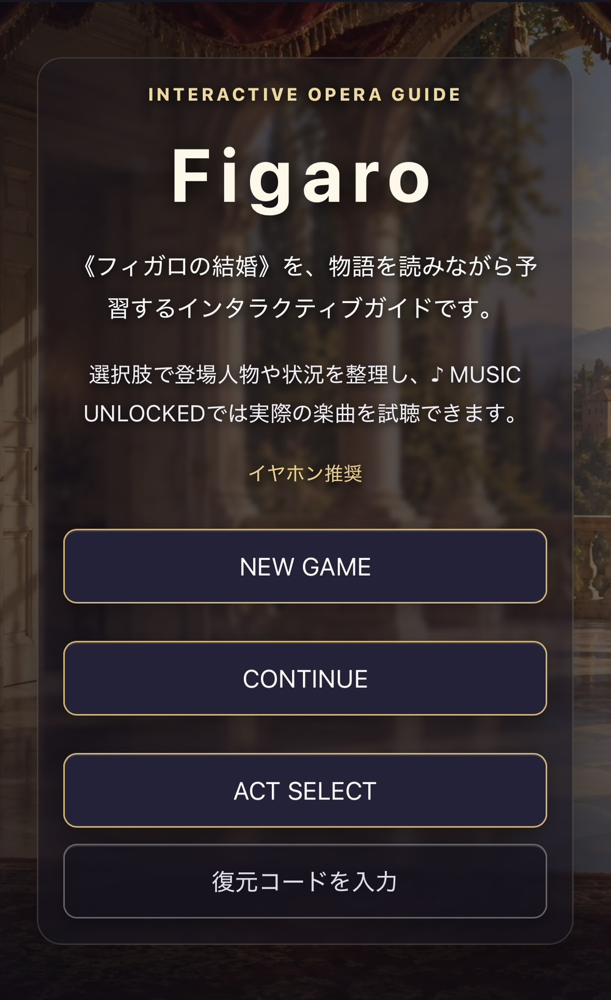
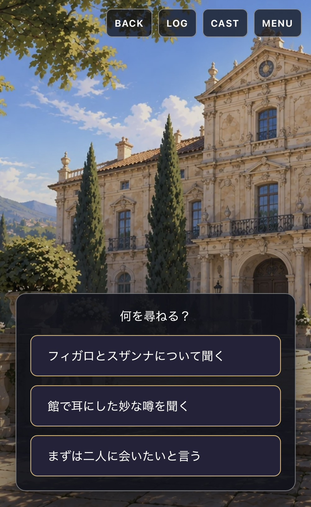
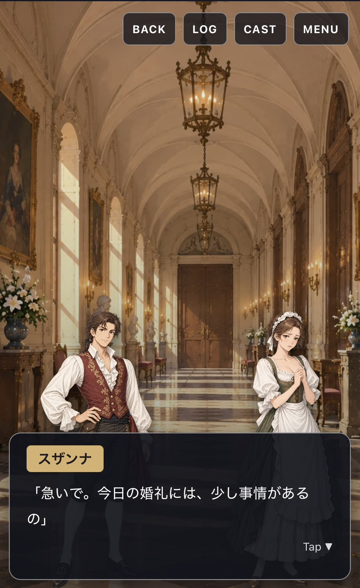
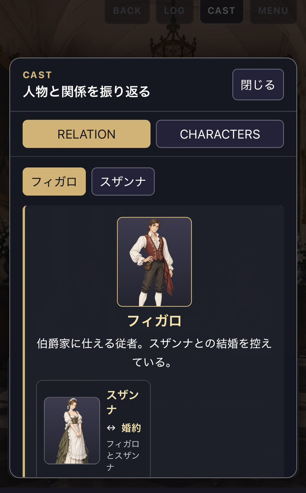

# Figaro

モーツァルト《フィガロの結婚》（*Le nozze di Figaro*）を観劇する前に、物語と音楽をADV形式で楽しく予習するためのWebアプリです。

PROLOGUEからACT 4まで、登場人物の思惑やすれ違いを読み進めながら、選択肢で情報や人物への注目を残せます。重要なアリア・重唱に到達すると、その場面で「誰が、なぜ歌うのか」を確認し、YouTube埋め込みプレイヤーから演奏を試聴できます。

> 舞台鑑賞の前に、物語・人物関係・音楽の聴きどころを一つの流れで把握することを目指しています。

## Concept

《フィガロの結婚》は、恋愛、身分差、手紙、変装、誤解が同時に動く喜劇です。本作では物語をADVとして追いながら、人物関係と音楽が入る理由を自然に理解できるようにしています。

- 選択肢は物語の大筋を変えず、観察した情報や好感度に影響します
- 分岐後は本筋へ合流するため、初見でも全4幕を最後まで追えます
- MUSIC UNLOCKEDで、場面・曲の意味・観劇ポイントを確認できます
- CASTでは、進行状況に応じて人物と関係を振り返れます

## Screenshots

### Title screen

新規開始、CONTINUE、ACT SELECT、復元コード入力をまとめた入口画面です。



### ADV story and choices

背景と選択肢を組み合わせ、最初に何を尋ねるかをプレイヤー自身が選びます。選択は物語の本筋を変えず、情報や人物への注目として残ります。



### Dialogue screen

立ち絵、背景、会話ボックスを使ったノベルゲーム本編の画面です。スマホの縦画面で読み進めやすいレイアウトを目指しています。



### CAST / RELATION

登場済み人物と、物語の進行に応じて判明した関係を確認できます。まだ知るべきではない情報は表示しません。



## Features

### ADV Story

PROLOGUEからACT 4、THE ENDまでを収録しています。`dialogue`、`choice`、`branch`、`end`のノードを組み合わせ、SceneおよびScenarioをまたぐ遷移に対応しています。

選択肢はflagsやaffinityを変化させ、後続の追加描写や自動分岐に利用されます。一方で、原作の主要な出来事は共通の本筋へ合流します。

### MUSIC UNLOCKED

音楽データは `src/data/music.ts` で管理しています。物語中の `presentation.musicId` を通じて曲を参照し、以下を専用カードで表示します。

- 曲名と歌唱人物
- この場面
- この曲の意味
- 観劇ポイント
- YouTube埋め込みプレイヤー（ユーザー操作後に表示）

通常のBGM自動再生は行いません。プレイヤーが「演奏を聴く」を押したときだけ、YouTubeの公式埋め込みプレイヤーを表示します。

### CAST

プレイ中はCASTから人物情報を確認できます。

- `RELATION`: 選択した人物を中心に、現在までに判明した直接関係を表示
- `CHARACTERS`: 登場済み人物の紹介と関係ラベルを表示
- 会話ログ、現在の立ち絵、Scenario進行、flagsをもとに登場済みかを判定
- 親子関係、借金契約、伯爵の関心、変装などは、判明するまで表示を抑制

CASTの開閉や人物選択はゲーム進行、flags、affinity、ログ、セーブデータを変更しません。

### BACK / LOG

- **BACK**: 遷移前のGameState全体を復元します。選択によるflags / affinityの変化も巻き戻せます
- **LOG**: 台詞、地の文、MUSIC UNLOCKED、観劇ポイント、選択内容を読み返せます

BranchNodeの自動遷移はBACKの1手として露出せず、プレイヤーが操作した進行単位で履歴を残します。

### ACT SELECT

タイトル画面からPROLOGUE、ACT 1、ACT 2、ACT 3、ACT 4を直接開始できます。途中の幕から始める場合は、その幕までに本筋上必ず成立している情報だけをプリセットとして設定し、選択依存のflags・affinityは初期化します。

### Save / Continue

進行状況と会話ログはブラウザの`localStorage`に自動保存されます。

- **CONTINUE**で同じブラウザ・端末の進行を再開
- **復元コード**で、Scenario位置・flags・affinityを別端末でも復元可能

復元コードには会話ログを含めません。復元後のLOGは空の状態から始まります。

### Ending

ACT 4の終了後には、プレイ中のflagsとaffinityをもとにした振り返り画面を表示します。観劇タイプ、特に注目した人物、舞台で注目してほしいポイントを確認できます。

## Tech Stack

- React
- TypeScript
- Vite
- Zustand
- CSS
- WebP
- Cloudflare Workers（静的アセットのデプロイ先）

## Architecture

シナリオデータ、シナリオエンジン、状態管理、表示UIを分離しています。

```text
Scenario data ──> scenarioEngine ──> Zustand gameStore ──> Novel UI
     │                    │                   │                 │
     ├─ characters        ├─ conditions       ├─ save / log      ├─ BackgroundLayer
     ├─ backgrounds       ├─ effects          └─ back history    ├─ CharacterLayer
     └─ music             └─ transitions                         └─ dialogue / choice / modal UI
```

- **Scenario data**: Scene・Node・presentation・分岐をTypeScriptで定義
- **scenarioEngine**: 次のScene / Scenarioを解決し、BranchNodeを自動評価
- **gameStore**: 進行、flags、affinity、BACK履歴、LOG、自動保存を管理
- **Novel UI**: 背景、立ち絵、会話、選択肢、音楽、CAST、メニューを表示

## Scenario System

シナリオはJSONではなくTypeScriptで記述し、型チェックと起動時validatorで記述ミスを検出します。

```ts
type Scenario = {
  id: string
  title: string
  initialSceneId: string
  scenes: Record<string, Scene>
}

type Scene = {
  id: string
  backgroundId?: string
  initialNodeId: string
  nodes: Record<string, StoryNode>
}

type NextTarget = {
  scenarioId?: string
  sceneId?: string
  nodeId: string
}
```

StoryNodeは次の4種類です。

- `dialogue`: 台詞・地の文。effectsとnextを持てます
- `choice`: 選択肢。各Choiceはeffectsとnextを持てます
- `branch`: 状態に応じた自動遷移。必ず`default`遷移先を持ちます
- `end`: Scenarioまたはゲームの終了地点

Conditionはflag・affinityの比較と、`all` / `any` / `not`の組み合わせに対応します。Effectはflag設定・flag加算・affinity変化に対応します。

`NextTarget`は同一Scene、別Scene、別Scenarioへの遷移を表現できます。Scenarioをまたぐ場合もflagsとaffinityは維持されます。

### Validation

起動時に全Scenarioを検証します。主な検証内容は以下です。

- Scenario / Scene / Node IDとオブジェクトキーの一致
- 初期Scene・初期Node・遷移先Nodeの存在
- Scenario間遷移先のScenario / Scene / Nodeの存在
- `speakerId`と`presentation.characters[].characterId`の存在
- 指定した`expressionId`がそのキャラクターに存在すること
- SceneおよびNodeの`backgroundId`、`musicId`のマスター存在確認

## Project Structure

```text
src/
├─ app/                 # Reactアプリの入口
├─ components/novel/    # ノベル画面、立ち絵、背景、モーダル、音楽カード
├─ data/
│  ├─ scenarios/        # PROLOGUE〜ACT 4のScenarioデータ
│  ├─ characters.ts     # キャラクターマスター
│  ├─ backgrounds.ts    # 背景マスター
│  ├─ music.ts          # MusicTrackマスター
│  └─ actStartPresets.ts# ACT SELECT用開始状態
├─ engine/              # 型、条件評価、effects、遷移、validator、保存コード
├─ features/
│  ├─ cast/             # CASTの公開情報・関係定義
│  └─ ending/           # エンディング振り返り評価
├─ stores/              # Zustand gameStore
└─ styles/              # モバイルファーストの共通CSS

public/
├─ backgrounds/         # WebP背景画像
└─ characters/          # キャラクター別のWebP立ち絵・表情
```

## Setup

### Requirements

- Node.js
- npm

### Install and run

```bash
npm install
npm run dev
```

Viteが表示するローカルURLをブラウザで開いてください。

### Production build

```bash
npm run build
```

Windowsのコマンドプロンプトでは、必要に応じて次のように実行できます。

```bash
npm.cmd run build
```

## Responsive / Mobile First

スマホの縦画面を優先して設計しています。

- `100dvh`とsafe areaを考慮したゲーム画面
- 画面全面の背景と、画面下部の会話ボックス
- left / center / rightの立ち絵配置
- タップで進行できるDialogueNode
- 十分なタップ領域を持つ選択肢とトップバー
- LOG、CAST、MENU、音楽カードの縦スクロール対応

PCではゲーム画面の最大幅を設定し、極端な横長表示を避けます。

## Assets

背景と立ち絵は`public/`以下で管理しています。アプリ内では背景ID・キャラクターID・表情IDを通して参照します。

- 背景: 伯爵邸外観、廊下、支度部屋、伯爵夫人の寝室、大広間、夜の庭、タイトル画面
- 立ち絵: フィガロ、スザンナ、伯爵、伯爵夫人、ケルビーノ、マルチェリーナ、バルトロ、バジリオ、アントニオ、ドン・クルツィオ、バルバリーナ

背景・キャラクター立ち絵・一部の画面素材には、ChatGPTで生成した画像を使用しています。

これらの画像素材の再利用・再配布については、リポジトリ所有者へお問い合わせください。

## About *Le nozze di Figaro*

本作はモーツァルトのオペラ《フィガロの結婚》を題材にした非公式の鑑賞準備用アプリです。原作オペラおよび各YouTube動画の権利は、それぞれの権利者に帰属します。

アプリ内のYouTubeプレイヤーは公式の埋め込み機能を利用しており、動画や音声ファイルをダウンロード・再配布しません。
